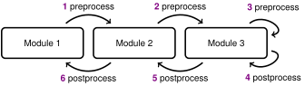
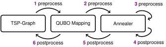

# QUARK-framework

### A modular benchmarking framework for quantum computing applications

QUARK-framework lets you configure, execute, and compare modular computational problems, with a focus on quantum optimization and qml use cases.

## Benchmarking Pipelines
Benchmarking runs are seperated into pipelines, consisting of swappable modules.
Each module is given data from its upstream module, performs some preprocessing work, and passes the result to its downstream module.
After the data was passed through the pipeline it is passed back up, triggering a postprocessing step in each module passed.

<div align="center">
    
</div>

QUARK-framework does not provide any module, but can be extended by any number of plugins, each providing one or more modules.
In most cases this is done by installing each plugin via pip before running QUARK-framework.

## Config Files
To tell QUARK-framework which plugins to use and how to construct its pipelines, a config file must be provided.

<!-- <details>
<summary>example_config.yml</summary> -->

```yaml
plugins: ["plugin_1", "plugin_2"]

pipeline: ["module_1", "module_2", "module_3"]
```
<!-- </details> -->

A config must specify the `plugins` that should be loaded and a description of the pipelines to run.
In the example above, `plugin_1` and `plugin_2` each provide one or more modules.
All specified plugins must be available to be imported.


All modules that are part of the `pipeline` must be among the modules provided by the loaded plugins.
The order the `pipeline` modules will be the order they are run in.
The respective interface types of each module must match for a pipeline to be valid, i.e. the downstream type of `module_1` must match the upstream type of `module_2`.

### Module Parameters
A module can either be specified by its name, or as a dict containing only one key, where the key is its name and the value is a dict or paramters.
These paramters will be passed to the module when it is created.
```yaml
plugins: ["plugin_1", "plugin_2"]

pipeline: [
    "module_1": {param1: value1, param2: value2},
    "module_2",
    "module_3": {param: value},
]
```

### Pipeline Layers
Each element in the `pipeline` array is actually a pipeline layer, which itself can be an array, containing one or more modules making up that layer.
Each of those modules is interpreted as being swappable with every other module in its layer.
The set of all pipelines is equal to all possible permutations of modules inside all pipeline layers.
Modules inside module layers can be provided as a string or dict, as explained in [Module Parameters](#module-parameters).
```yaml
plugins: ["plugin_1", "plugin_2"]

pipeline: [
    ["module_1a", "module_1b"],
    "module_2",
    ["module_3": {param: value1}, "module_3": {param: value2}],
]
```
This config file would result in a total of $2\cdot1\cdot2=4$ pipelines to be constructed and executed.

### Comparing Incompatible Modules
Modules can only be swapped if their upstream and downstream types match.
However, sometimes it might be necessary to compare one benchmarking pipeline with another where only some of their module share common interfaces.
In such cases, it is possible to specify the `pipelines` value, an array of `pipeline` specifications. 
Each `pipeline` specification can still use the layered format introduced in [Pipeline Layers](#pipeline-layers).
```yaml
plugins: ["plugin_1", "plugin_2"]

pipeline_1: &pipeline_1 [
    ["module_1a", "module_1b"],
    "module_2",
    "module_3",
]

pipeline_2: &pipeline_2 [
    ["module_1a", "module_1b"],
    "module_4",
]
```
This config file would result in a total of $2\cdot1\cdot1+2\cdot1=4$ pipelines to be executed.

## Example
A common pipeline pattern is to first pose some optimization problem like a TSP graph, then mapping the problem to a QUBO formulation, and finally solving it on a quantum annealer.
Such a pipeline could look like this:
<div align="center">
    
</div>

To evaluate the performance of the quantum annealer module, it could be exchanged with a simulated annealer module with the same interface types.
Additionally, the TSP problem can be solved directly by a classical solver.
To perform such a comparison for different graph sizes, the following config file can be used:

```yaml
plugins: ["quark_plugin_tsp", "quark_plugin_devices_dwave"]

first_layer:
  &first_layer [
    "tsp_graph_provider": { nodes: 4, seed: 43 },
    "tsp_graph_provider": { nodes: 5, seed: 43 },
    "tsp_graph_provider": { nodes: 6, seed: 43 },
  ]

second_layer: &second_layer "tsp_qubo_mapping_dnx"

third_layer: &third_layer [
  "simulated_annealer",
  "quantum_annealer": {TODO api token here}
]

pipeline1: &pipeline1 [
  *first_layer,
  *second_layer, 
  *third_layer,
]

pipeline2: &pipeline2 [
  *first_layer,
  "classical_tsp_solver",
]

pipelines: [*pipeline1, *pipeline2]
```

This example uses the two plugins `quark-plugin-tsp` and `quark-plugin-devices-dwave`.
Both are included in the QUARK plugin ecosystem and available as pip packages.
To run this config file, install all necessary dependencies and run QUARK-framework, passing the path to this config file:
```properties
pip install quark-framework quark-plugin-tsp quark-plugin-devices-dwave
python -m quark -c path/to/config/file
```

This results in $3\cdot1\cdot2+3\cdot1=9$ pipelines to be created and executed.